# Coleção digital online

Este é um aplicativo que permite ao usuário salvar múltiplos itens dentro de coleções, podendo adicionar imagens e etiquetas para melhor navegação por seus itens. O projeto foi criado com React, Next, TypeScript e Tailwind, e faz uso dos pacotes [uuidv4](https://www.npmjs.com/package/uuidv4) e [dnd-kit](https://dndkit.com/).

## Índice

-  [Previews](#previews)
-  [Como usar](#como-usar)

   -  [Adicionando coleções e itens](#adicionando-coleções-e-itens)
   -  [Editando e removendo itens](#editando-e-removendo-itens)
   -  [Filtrando e ordenando itens](#filtrando-e-ordenando-itens)

-  [Posfácio](#posfácio)
   -  [Autor](#autor)

## Previews

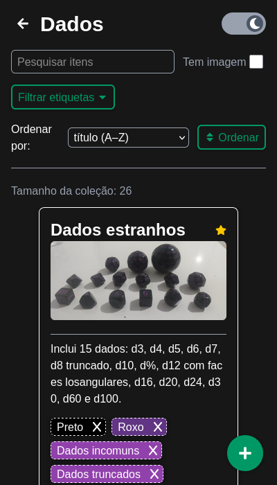
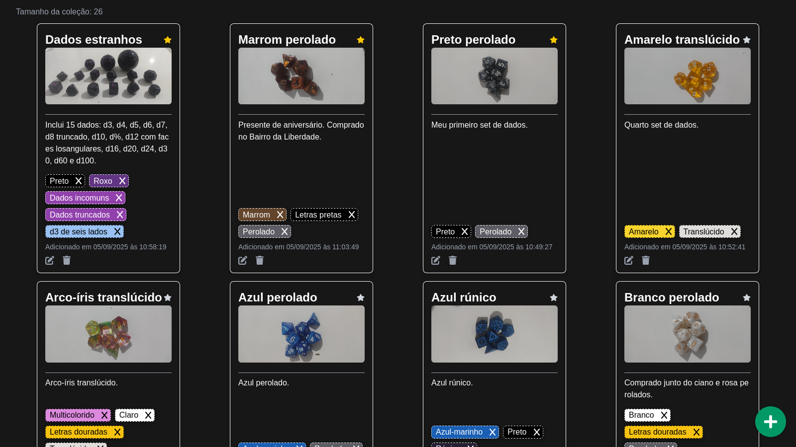

## Como usar

Para começar, acesse o app através do seguinte link: https://digital-collection-five.vercel.app/

Ao acessar pela primeira vez, você verá a tela inicial. Você pode alterar entre um modo claro e um modo escuro com um botão no cabeçalho. Mais importante, pode adicionar uma nova coleção com um botão no canto inferior direito da tela.

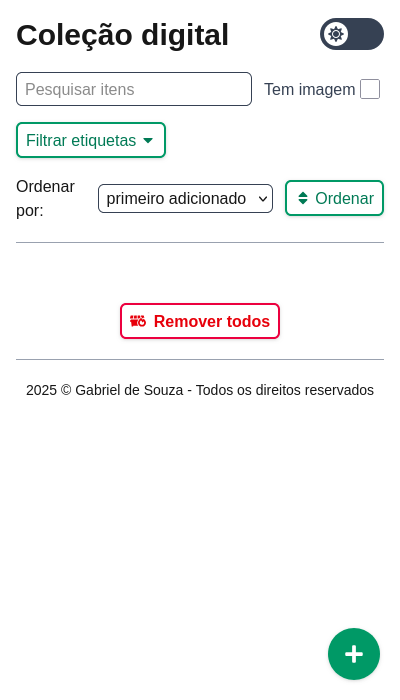
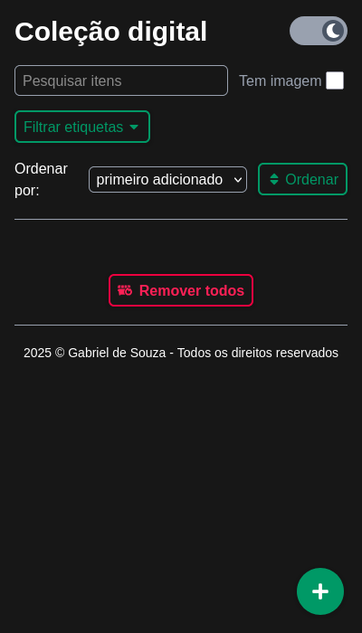

### Adicionando coleções e itens

É obrigatório preencher os campos de nome e descrição. Também pode-se adicionar uma imagem e etiquetas com cores e nomes à sua escolha.

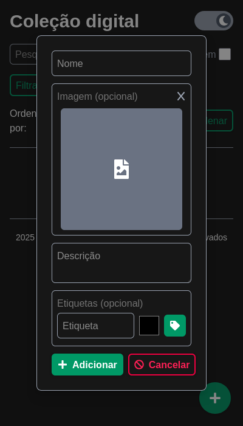
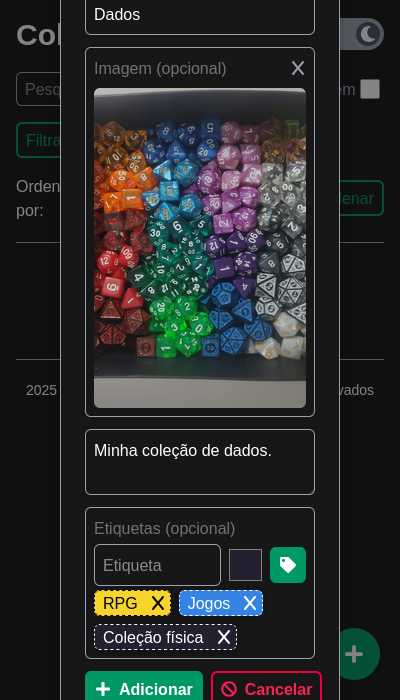
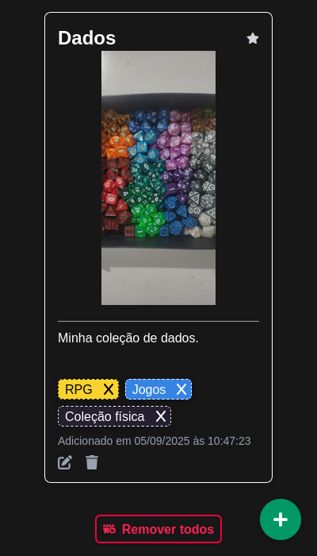

O processo é o mesmo para adicionar itens dentro da coleção.

### Editando e removendo itens

Na parte inferior de cada cartão, tanto de item quanto de coleção, há botões para editar ou remover um item. Ao editar, o mesmo formulário para adicionar um item aparece. Ao clicar em remover, é preciso confirmar a remoção antes de continuar.

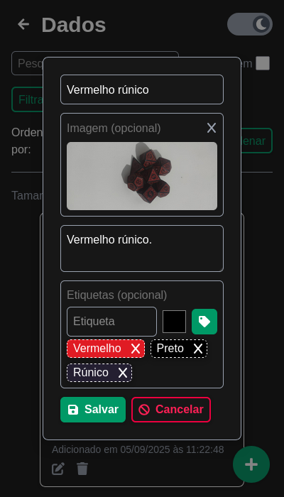
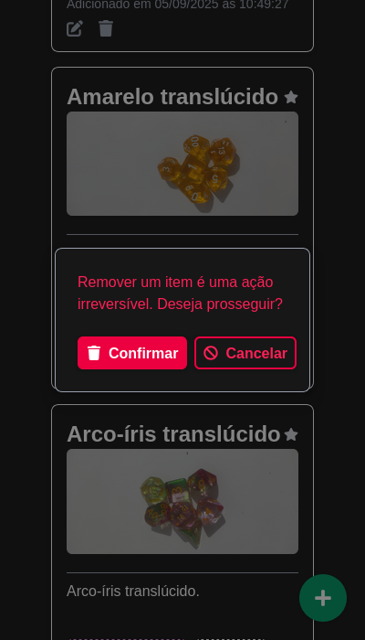

Abaixo de todos os cartões, há um botão para remover todos os itens (ou todas as coleções, se estiver na página inicial). Em ambos os casos, uma confirmação aparece antes de continuar.

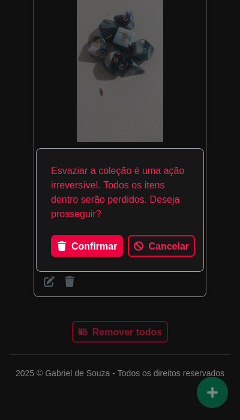

### Filtrando e ordenando itens

A seguir há descrições de como filtrar e ordenar suas coleções e itens. Note que, após o título de cada cartão, há um botão para favoritar a coleção ou item. Cartões favoritos sempre aparecem antes que o resto.

A primeira forma de filtragem é pela barra de pesquisa. Escreva o que deseja pesquisar e a página atualizará automaticamente, mostrando apenas cartões que possuem o termo pesquisado no título ou descrição. Ao lado da barra também há um botão para mostrar apenas cartões com imagens.

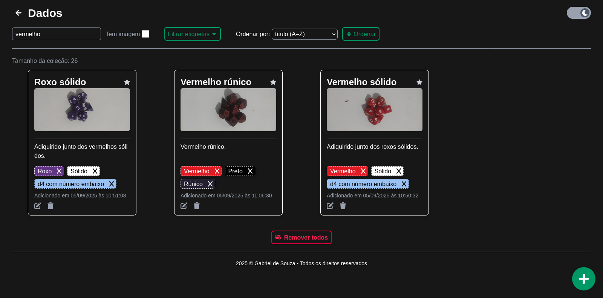

A segunda forma é filtrando por etiquetas. Clique no botão de "filtrar etiquetas" e selecione quais etiquetas deseja ver. Apenas cartões com as etiquetas selecionadas aparecerão.

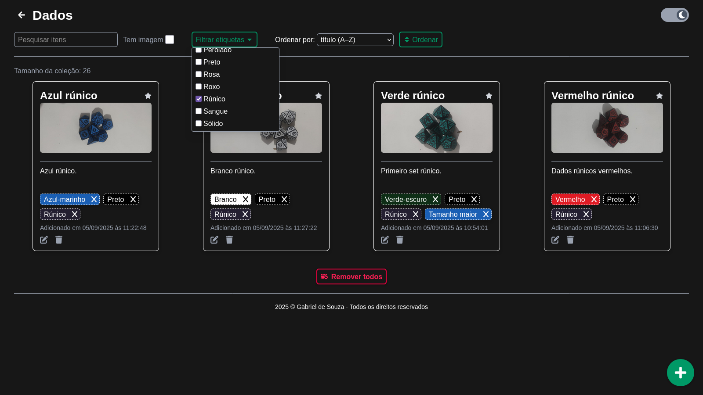

Por fim, o usuário pode ordenar os itens for ordem de adição ou alfabética, tanto crescente quanto decrescente. Lembre-se de apertar o botão de "Ordenar" para que a ordenação ocorra.

## Posfácio

**Repositório**: https://github.com/gab-souza-martins/digital-collection

### Autor

**GitHub**: https://github.com/gab-souza-martins

**Portifólio**: https://gab-souza-martins.github.io/portifolio-junior/
